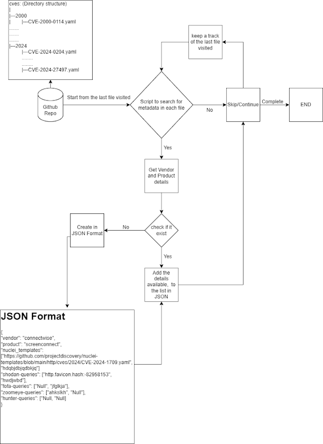

# Nuclei-Analysis

Automation on Zero Day's Shodan Queries

    This script fetches YAML files from a specified GitHub repository and folder path, extracts metadata from them, and stores the details in a JSON file. It also logs URL changes in a separate log file.

## Work flow



## Usage

1. **Setup:**

   - Create a file named `last_processed_url.txt` and add the last extracted URL to it. This file is used to resume processing from where it left off.
   - Modify the `repo_url` and `folder_path` variables in the script to match the repository and folder containing the YAML files you want to process.
   - Install the required libraries using pip:
     ```bash
     pip install requests PyYAML json
     ```

2. **Running the Script:**

   - Run the script. It will fetch YAML files from the specified GitHub repository and folder path, extract metadata, and store the details in a JSON file specified by the `filename` variable.
   - The script will update the `last_processed_url.txt` file with the last processed URL, so it can resume from where it left off in case of interruption.

3. **Output:**
   - The script creates a JSON file (`output_details.txt`) containing vendor details extracted from the YAML files.
   - It also logs URL changes in a separate log file (`url_changes.log`).

## Example Output

```json
{
  "vendors": {
    "microsoft": {
      "products": [
        {
          "product": "internet_information_server",
          "nuclei_templates": [
            "https://github.com/projectdiscovery/nuclei-templates/blob//main/http/cves/2000/CVE-2000-0114.yaml?raw=true"
          ],
          "shodan_queries": ["null"],
          "fofa_queries": ["null"],
          "zoomeye_queries": ["null"],
          "hunter_queries": ["null"]
        },
        {
          "product": "exchange_server",
          "nuclei_templates": [
            "https://github.com/projectdiscovery/nuclei-templates/blob//main/http/cves/2008/CVE-2008-1547.yaml?raw=true"
          ],
          "shodan_queries": ["http.title:\"Outlook\""],
          "fofa_queries": ["null"],
          "zoomeye_queries": ["null"],
          "hunter_queries": ["null"]
        }
      ]
    }
  }
}
```

## URL Change Log

```plaintext
URL changed to https://github.com/projectdiscovery/nuclei-templates/blob//main/http/cves/2000/CVE-2000-0114.yaml?raw=true at 2024-03-20 10:23:22
URL changed to https://github.com/projectdiscovery/nuclei-templates/blob//main/http/cves/2001/CVE-2001-0537.yaml?raw=true at 2024-03-20 10:23:22
URL changed to https://github.com/projectdiscovery/nuclei-templates/blob//main/http/cves/2002/CVE-2002-1131.yaml?raw=true at 2024-03-20 10:23:23
URL changed to https://github.com/projectdiscovery/nuclei-templates/blob//main/http/cves/2004/CVE-2004-0519.yaml?raw=true at 2024-03-20 10:23:24
URL changed to https://github.com/projectdiscovery/nuclei-templates/blob//main/http/cves/2004/CVE-2004-1965.yaml?raw=true at 2024-03-20 10:23:24
URL changed to https://github.com/projectdiscovery/nuclei-templates/blob//main/http/cves/2005/CVE-2005-2428.yaml?raw=true at 2024-03-20 10:23:25
URL changed to https://github.com/projectdiscovery/nuclei-templates/blob//main/http/cves/2005/CVE-2005-3344.yaml?raw=true at 2024-03-20 10:23:26
URL changed to https://github.com/projectdiscovery/nuclei-templates/blob//main/http/cves/2005/CVE-2005-3634.yaml?raw=true at 2024-03-20 10:23:26
```

## Notes

- Modify the script as needed to fit your specific requirements.
- Ensure that you have the necessary permissions to access the GitHub repository and folders.

---
